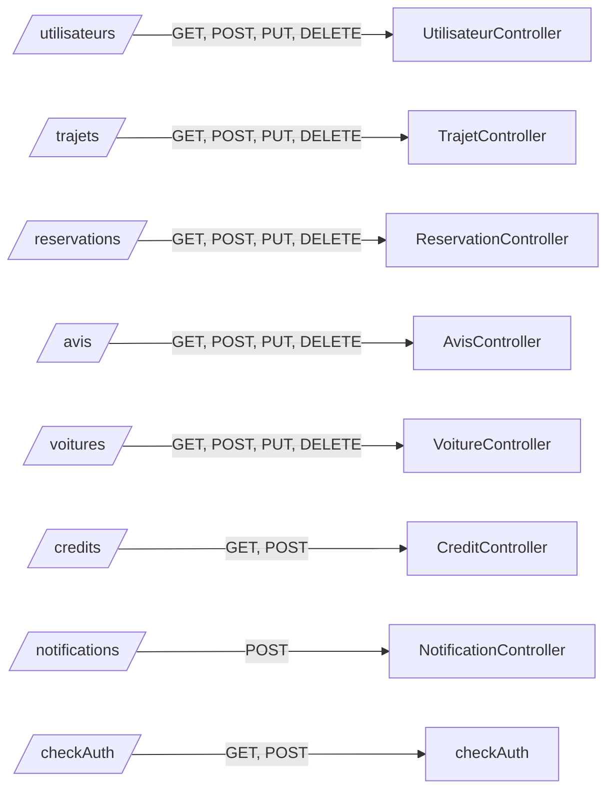

# Structure de l’API EcoRide

## 1. Arborescence des dossiers

```
api/
│
├── index.php
├── composer.json
├── Dockerfile
├── render.yaml
├── config/
│   ├── Database.php
│   └── session.php
├── Controllers/
│   ├── UtilisateurController.php
│   ├── TrajetController.php
│   ├── ReservationController.php
│   ├── AvisController.php
│   ├── VoitureController.php
│   ├── CreditController.php
│   ├── NotificationController.php
│   ├── HistoriqueActionController.php
│   └── checkAuth.php
├── ControllersAdministrateur/
│   ├── TrajetAdminController.php
│   ├── UtilisateurAdminController.php
│   └── SignalementAdminController.php
├── models/
│   ├── Utilisateur.php
│   ├── Trajet.php
│   ├── Reservation.php
│   ├── Avis.php
│   ├── Voiture.php
│   ├── Credit.php
│   ├── Notification.php
│   └── Dashboard.php
├── ModelAdministrateur/
│   ├── Trajet.php
│   ├── Utilisateur.php
│   ├── Signalement.php
│   └── Statistique.php
├── Utils/
│   ├── NotificationMails.php
│   └── Mailer.php
├── docs/
│   ├── documentation_technique.md
│   ├── manuel_utilisateur.md
│   ├── guide_deploiement.md
│   ├── fixtures_documentation.md
│   └── diagrams.md
└── lib/
    └── PHPMailer-7.0.0/
```

## 2. Principaux endpoints API

| Ressource         | Contrôleur                     | Méthodes disponibles         | Exemple d’URL                                      |
|-------------------|-------------------------------|-----------------------------|----------------------------------------------------|
| Utilisateurs      | UtilisateurController.php      | GET, POST, PUT, DELETE      | `/Controllers/UtilisateurController.php`           |
| Trajets           | TrajetController.php           | GET, POST, PUT, DELETE      | `/Controllers/TrajetController.php`                |
| Réservations      | ReservationController.php      | GET, POST, PUT, DELETE      | `/Controllers/ReservationController.php`           |
| Avis              | AvisController.php             | GET, POST, PUT, DELETE      | `/Controllers/AvisController.php`                  |
| Voitures          | VoitureController.php          | GET, POST, PUT, DELETE      | `/Controllers/VoitureController.php`               |
| Crédits           | CreditController.php           | GET, POST                   | `/Controllers/CreditController.php`                |
| Notifications     | NotificationController.php     | POST                        | `/Controllers/NotificationController.php`          |
| Authentification  | checkAuth.php                  | GET, POST (logout)          | `/Controllers/checkAuth.php`                       |

## 3. Exemple de schéma endpoints (Mermaid)



## 4. Documentation détaillée

- [docs/documentation_technique.md](docs/documentation_technique.md) : détails sur chaque endpoint, paramètres, exemples de requêtes/réponses.
- [docs/manuel_utilisateur.md](docs/manuel_utilisateur.md) : guide utilisateur.
- [docs/fixtures_documentation.md](docs/fixtures_documentation.md) : jeux de données de test.

---

> Pour plus d’informations, consulte la documentation technique du projet.